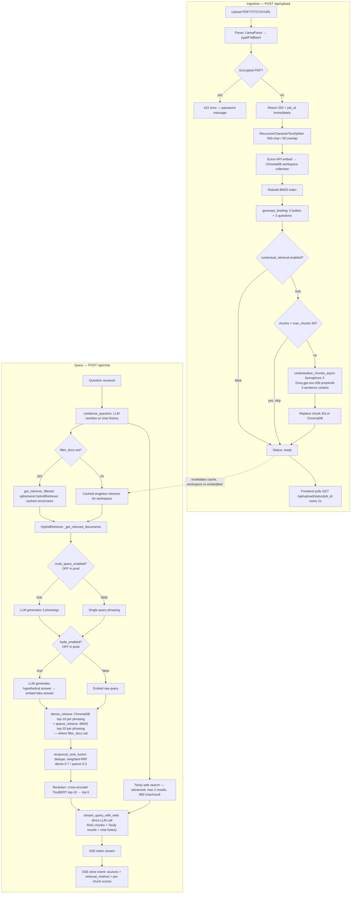

# Architecture — Prism

## Problem
Fintech analysts spend hours manually reading RBI circulars, NPCI reports, and earnings transcripts. Standard dense-only RAG fails silently and misses exact keyword matches in regulatory text (section numbers, policy codes).

## Architecture overview
Upload → chunk (500-char) → optional contextual augmentation (LLM prepends 2-sentence context per chunk) → embed via Euron API → store in ChromaDB + BM25 index. Query → optional HyDE expand → optional multi-query expand → hybrid retrieval (ChromaDB dense + BM25 sparse) → weighted RRF fusion → cross-encoder rerank (top-10 → top-5) → Tavily web search → LLM answer via SSE stream → LangSmith trace. Multi-workspace: each workspace has its own ChromaDB collection; vectorstore + retriever cached per workspace. Upload returns 202 immediately; embed + contextualize run as background task polled via `GET /api/upload/status/{job_id}`. Eval runs offline via `scripts/run_eval_versioned.py`; results served by a separate `eval-dashboard/` static site.

## Flow chart

## Component breakdown

| Component | Technology | Purpose |
|-----------|------------|---------|
| Vector store | ChromaDB (persistent) | Dense embedding storage and retrieval |
| Sparse retrieval | rank_bm25 (BM25Okapi) | Keyword-match retrieval for regulatory text |
| Hybrid fusion | Weighted RRF (dense 0.7 + sparse 0.3) | Merge dense + sparse result lists |
| Reranker | cross-encoder/ms-marco-TinyBERT-L-2-v2 | Re-score top-10 → return top-5 (~17MB; chosen over MiniLM-L-6-v2 ~85MB for lower memory footprint) |
| Embeddings | Euron API (text-embedding-3-small) | API-based; Groq has no embeddings endpoint. |
| LLM | Groq (llama-3.3-70b-versatile) via langchain-groq | Fast open-weight inference; OpenAI-compatible |
| Chunking | RecursiveCharacterTextSplitter (500-char, overlap 50) | Single-pass split; semantic chunking available but disabled (ablation: +9.3pp recall, −27.3pp P@5, 5× latency) |
| Contextual retrieval | LLM (openai/gpt-oss-20b) at ingest time | Prepends 2-sentence situating context per chunk before embedding; +18% recall. Async via Semaphore(3). `max_chunks: 50` gate skips contextual for oversized docs to bound latency. |
| HyDE | Groq LLM generates hypothetical answer before dense search | Closes question/answer vector space gap; +21pp recall (measured). OFF by default in prod — disabled 2026-07-05 for free-tier Groq TPM stability. Toggle: `config.yaml hyde_enabled`. |
| Multi-Query | Groq LLM generates 3 query phrasings | Widens candidate pool before RRF; best-rank dedup. OFF by default in prod — disabled 2026-07-05 for free-tier Groq TPM stability. Toggle: `config.yaml multi_query_enabled`. |
| Web search | Tavily (advanced, max 2 results, 800-char truncation) | Mandatory on every query; grounded answers for open-domain questions |
| Memory | ConversationBufferWindowMemory (k=10) | Last 10 conversation turns |
| Chain | `stream_query_with_web()` — direct LLM call bypassing ConversationalRetrievalChain | Bypasses chain to prevent condensation step stripping web context; yields SSE token stream |
| Streaming | FastAPI `StreamingResponse` + SSE | Token events during generation; `done` event with sources + retrieval_method |
| Async upload | 202 + job_id; background `_embed_and_contextualize_bg` | User queryable in <3s; embed + contextualize run in background; poll `GET /api/upload/status/{job_id}` |
| File serving | `GET /api/files/{filename}` → FileResponse | Serves uploaded docs for citation popover "Open page N →" links; path traversal blocked via `is_relative_to()` |
| Citation | `[N]` markers in LLM answer → CitationPopover (React) | Clickable superscripts show full chunk text, page, rerank score; PDF page link via file serving route |
| Workspace | ChromaDB collection per workspace | Isolated document sets; switcher in frontend sidebar |
| Retriever cache | Module-level dict keyed by workspace | Singleton vectorstore+retriever per workspace; invalidate on ingest |
| Eval | Separate `eval-dashboard/` Vite+React static site | Reads versioned JSON run files; metrics: answer_correctness, answer_relevancy, context_recall, precision@5, latency p50/p95/p99 |
| Eval script | `scripts/run_eval_versioned.py` | Runs offline against 50-pair ground truth; writes versioned JSON + updates index.json |
| Eval ground truth | `data/ground_truth/eval_pairs.json` (50 pairs) | Multi-hop, comparative, negative, numeric, edge-case questions with reference answers |
| Observability | LangSmith | Traces all LLM + retrieval calls via LANGCHAIN_TRACING_V2=true |
| Document parsing | LlamaParse (primary), pypdf (fallback) | PDF extraction |
| Backend | FastAPI + Uvicorn | REST API |
| Frontend | React 19 + Vite + Tailwind CSS v4 | Chat / Upload tabs |
| Deployment | HF Spaces (Docker backend, 16GB RAM) + Vercel (frontend) + Vercel (eval-dashboard) | Production |

## Data flow

### Ingestion
1. `POST /api/upload` → parse PDFs/TXT/CSV → returns 202 + `job_id` immediately
2. Background task `_embed_and_contextualize_bg` starts:
   a. `RecursiveCharacterTextSplitter` (500-char, overlap 50) → chunks
   b. `embed_and_store()`: Euron API embeds chunks → store in ChromaDB (workspace collection)
   c. Rebuild BM25 index from new corpus
   d. `generate_briefing()`: LLM summarises first 6 chunks → 5 bullets + 3 suggested questions
   e. If `contextual_retrieval.enabled`: `contextualize_chunks_async()` — Groq 8B prepends 2-sentence context per chunk (Semaphore(3) → max 3000 TPM burst); replace old chunk IDs in ChromaDB with contextual versions
3. Frontend polls `GET /api/upload/status/{job_id}` every 2s → stages: embedding → contextualizing → ready

### Query
1. `POST /api/chat` receives question → returns `StreamingResponse` (text/event-stream)
2. `condense_question()`: LLM rewrites follow-up question using chat history → standalone query for search
3. Tavily web search (advanced, max 2 results, 800-char/result) runs in parallel with retrieval
4. `HybridRetriever._get_relevant_documents()`:
   a. If `multi_query_enabled`: LLM generates 3 phrasings; retrieve for each; pool + best-rank dedup
   b. If `hyde_enabled`: LLM generates hypothetical answer; embed fake answer for dense search
   c. `dense_retrieve`: ChromaDB top-10 per query phrasing (cosine similarity)
   d. `sparse_retrieve`: BM25 top-10 per query phrasing
   e. `reciprocal_rank_fusion`: merge → deduplicate → weighted RRF (dense 0.7, sparse 0.3)
   f. `Reranker.rerank`: cross-encoder scores all candidates jointly → top-5 chunks
5. `stream_query_with_web()`: direct LLM call with RAG chunks + Tavily results + chat history → streams tokens
6. SSE events: `{"type": "token", "content": "..."}` per chunk; `{"type": "done", "sources": [...], "retrieval_method": "..."}` at end
7. Sources include per-chunk scores: similarity, bm25, rrf, rerank

## Key design decisions
- **API embeddings over local**: Euron API embeddings ~0MB RAM; Groq has no embeddings endpoint so Euron is retained for embeddings.
- **RecursiveCharacterTextSplitter 500-char**: single-pass chunking; semantic chunking ablation (v1.4.0) showed +9.3pp recall but −27.3pp P@5 and 5× latency — rejected.
- **Cross-encoder reranker**: bi-encoder (ChromaDB) is fast but approximate; cross-encoder is slower but more accurate on top-10 pool.
- **BM25 weight 0.3**: regulatory text has exact keyword matches (section numbers); sparse retrieval catches what dense misses.
- **HyDE measured +21pp recall, disabled in prod**: hypothetical answer embedding closes question/answer vector space gap (0.51→0.72, v1.1.0). Adds one Groq call per query. Disabled 2026-07-05 — HyDE+MQ together = 4 Groq calls/query, causes 429 storms on free-tier 6000 TPM. Re-enable on paid tier.
- **Multi-Query measured, disabled in prod**: 3 phrasings widen candidate pool before RRF; best-rank dedup keeps highest-confidence rank. Adds one Groq call per query. Disabled 2026-07-05 alongside HyDE for same TPM reason.
- **Contextual retrieval — ON in prod**: LLM prepends 2-sentence situating context to each chunk at ingest before embedding. +18% recall (v1.3.0). `asyncio.Semaphore(3)` caps parallel Groq calls at 3000 TPM. `max_chunks: 50` gate skips contextual for oversized docs. Uses Euron-adjacent Groq small model (`openai/gpt-oss-20b`) — separate TPM budget from HyDE/MQ, stays on regardless of their toggle.
- **Mandatory web search**: always-on Tavily + RAG prevents hallucination on open-domain queries. Toggle removed after opt-in caused wrong corpus docs to be cited with high faithfulness score.
- **Streaming SSE**: `stream_query_with_web()` yields token events via FastAPI `StreamingResponse`. Bypasses `ConversationalRetrievalChain` condensation step (which strips web context). Direct LLM call with full context.
- **Async upload (202 pattern)**: parse+chunk synchronous (<1s) → return 202 + job_id → embed+contextualize in `BackgroundTask`. Frontend polls `GET /api/upload/status/{job_id}`. User queryable in <3s without waiting ~40s for contextualization.
- **Citation popover**: `[N]` markers in LLM output → clickable `` → `CitationPopover` shows full chunk text, source, page, rerank score. PDF sources get "Open page N →" link via `GET /api/files/{filename}`. `Path.is_relative_to()` guards against traversal.
- **TinyBERT-L-2-v2 reranker**: MiniLM-L-6-v2 (~85MB) vs TinyBERT-L-2-v2 (~17MB) — same ranking quality at demo corpus scale with lower memory footprint.
- **Singleton vectorstore/retriever cache**: each workspace caches its Chroma vectorstore + HybridRetriever in a module-level dict. Without cache, every chat request created a new Chroma instance (full embedding reload). Cache is invalidated after ingest.
- **Multi-workspace isolation**: each workspace maps to one ChromaDB collection. Frontend workspace switcher passes `workspace_id` on every request; backend resolves the correct collection before retrieval.
- **URL size guard**: `url_loader.py` enforces a max content size before embedding URL content, preventing memory spikes from large external pages.
- **Eval dashboard separate site**: eval runs offline via `scripts/run_eval_versioned.py`; results versioned as JSON. No live eval endpoint on prod. Per-message faithfulness badge removed — eval moved to dedicated dashboard.
- **answer_correctness over faithfulness**: faithfulness (LLM judge vs retrieved chunks) is circular — inflates when eval pairs are corpus-aligned. answer_correctness (LLM judge vs ground_truth reference) is an independent signal.
- **HF Spaces Docker (UID 1000)**: model weights baked into image under `HF_HOME=/app/.cache/huggingface` as user 1000 at build time; `HF_HUB_OFFLINE=1` set after download to block runtime network calls.

## Known limitations
- BM25 index rebuilt in memory on each startup (not persisted to disk)
- HF Spaces free tier: ephemeral filesystem — chroma_db lost on cold start (re-upload required)
- Euron embedding API sequential: ~1.7s/chunk — 30 chunks = ~52s in background (user unblocked via 202, but contextual refresh still takes ~15s with Semaphore(3))
- Groq free tier: contextual retrieval 429s frequent at large doc scale (>30 chunks) even at max_concurrent=3; some chunks fall back to non-contextual text
- `anchorRect` in CitationPopover stale after page scroll (acceptable for demo)

## Future improvements
- Persist BM25 index to disk (pickle) — eliminates ~1s rebuild on startup
- Mount HF persistent storage bucket — eliminate chroma_db loss on cold start
- ~~Metadata filtering~~ — shipped Stage 17 (sidebar doc chips → `filter_docs` on `/api/chat` → ChromaDB `where` + BM25 pool filter)
- Document comparison mode: retrieve from two collections, synthesise structured diff answer
- Agentic mode (LangGraph): replace ConversationalRetrievalChain with graph — nodes for retrieval, web search, calculator, synthesiser
